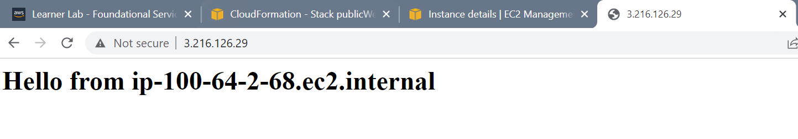

# CloudSystLab3
In this lab three yaml files are created to deploy the AWS infrasture using CloudFormation. A VPC configured with a private and public subnet. A Security group that permits SSH and HTTP traffic. As well as an EC2 template that is used to deploy a webserver in the public and private subnet.

## create-vpc.yml
The first CloudFormation stack created used the create-vpc.yml template file. This file configures a new VPC with a private and public subnet. A route table is created for each subnet and then associated. An Internet Gateway is created and attached to the VPC, as well as a NAT gateway that is used for outbound traffic for the private subnet.

The image below, describes the parameters selected while creating the stack. Notice under **availabilityZone**, both us-east-1a and us-east-1b were selected as examples. However, in the create-vpc.yml the first availabilityZone will be selected - this can be modified by changing the value selected here: ```AvailabilityZone: !Select [0, !Ref availabilityZones] ```


The following image describes the entire infrastructure that was created through create-vpc.yml.


## create-sg.yml
The second CloudFormation stack creates a security group that can be configured with two inbound rules. The parameters can be manually added by the user to permit traffic as shown in the image below.


## create-ec2.yml
The final yaml file contains a template to create an EC2 Webserver instance. The configuration includes conditionals to select whether the EC2 should be placed in a private or public subnet, which the user selects in the parameters as shown below:


Below displays the two instances created, one in the public subnet and the other in the private subnet:


## Testing the Webserver in the Public Subnet

The public IP address attached to the public webserver was used to test the EC2 configuration, and the website is succesfully reached.
